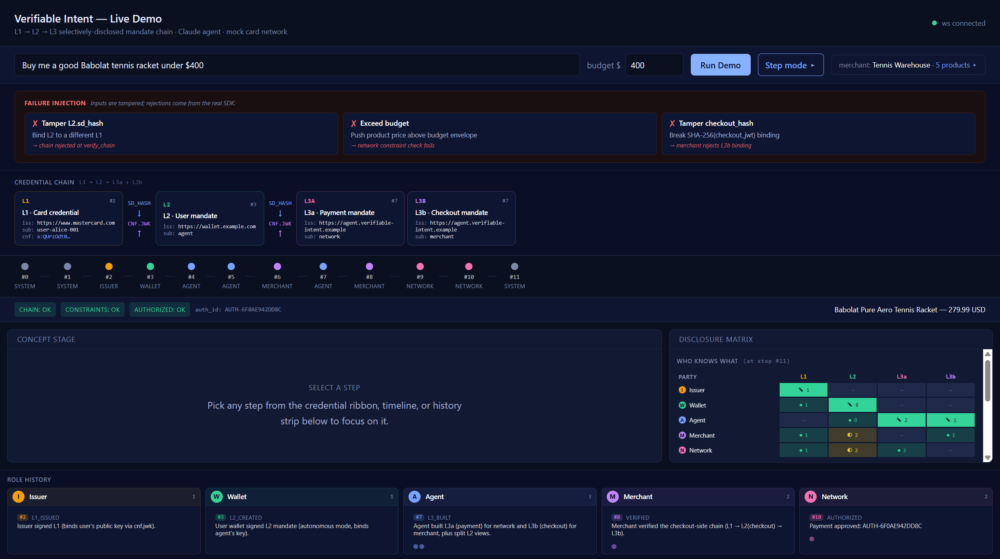

# Verifiable Intent — End-to-End Demo

A local demo that runs a real [Verifiable Intent](https://verifiableintent.dev/spec/) **autonomous-mode**
purchase end-to-end and visualizes every credential, disclosure, and verification step in a live web UI.



Built on top of the official [`verifiable-intent`](https://github.com/agent-intent/verifiable-intent)
Python SDK. The crypto chain (L1 → L2 → L3a / L3b SD-JWTs) is real; the merchant and payment
network are role modules we run locally; the agent uses **Anthropic Claude** to pick a product
that satisfies the user's constraints.

> **Payment rails**: The payment network is mocked in v1 (returns approved/declined based on
> simple rules) so the demo runs without any external accounts. The interface is kept clean so a
> real Stripe Test Mode adapter can drop in for v2.

## Architecture

Five logical roles, one FastAPI backend process (each role is a Python module with its own ES256
keypair). The orchestrator runs **12 steps** (1–9: success path; 10–12: optional failure-injection
divergence) and emits structured events over a WebSocket. A Vite + React frontend renders one
panel per role.

```
Issuer ──L1──▶ User Wallet ──L2──▶ Agent ──┬──L3b──▶ Merchant
                                           └──L3a──▶ Payment Network
```

## Quick start

```powershell
# Backend (Python 3.11+)
cd backend
uv venv
.\.venv\Scripts\Activate.ps1
uv pip install -e .
copy ..\.env.example ..\.env   # then edit .env and paste your Anthropic key
uvicorn app.main:app --reload

# Frontend (in another terminal)
cd frontend
npm install
npm run dev
```

Open <http://localhost:5173>, paste a prompt like *"Buy a Babolat tennis racket under $400"*,
click **Run Demo**, and watch the credential chain build itself.

## Layout

| Path | What's in it |
| --- | --- |
| `backend/app/` | FastAPI app, orchestrator, event bus |
| `backend/app/roles/` | One module per VI role (issuer, wallet, agent, merchant, network) |
| `backend/tests/` | End-to-end smoke test with a stub LLM |
| `frontend/src/` | React dashboard |
| `docs/architecture.md` | Mermaid sequence diagram of the 12-step flow |

## Known v0.1 simplifications (vs full spec)

- **Payment network is mock.** Approves ≤ $1,000; no Stripe yet. Interface is shaped
  so a `PAYMENT_NETWORK_MODE=stripe` adapter drops in for v2.
- **Network is stateless.** No nonce / replay tracking, no one-L3-per-pair enforcement,
  no cumulative spend tracking across L2-scoped calls. Real network MUSTs.
- **Checkout JWT carries no machine-readable merchant id.** Allowlist enforcement falls
  back to `iss` URL + the single-merchant catalog. Spec recommends an explicit `payee_id`.
- **Network verifier sees the full L2** (not just the payment view) so it can resolve the
  `allowed_payees` SD references. Marked in `roles/network.py`.
- **Spec anchors in `frontend/src/specRefs.ts` are best-effort** — the published spec page
  may have moved sections; update anchors there if you spot a stale link.

## Status

Work in progress. See `docs/` and the inline comments in each role module for the spec sections
each piece implements.
