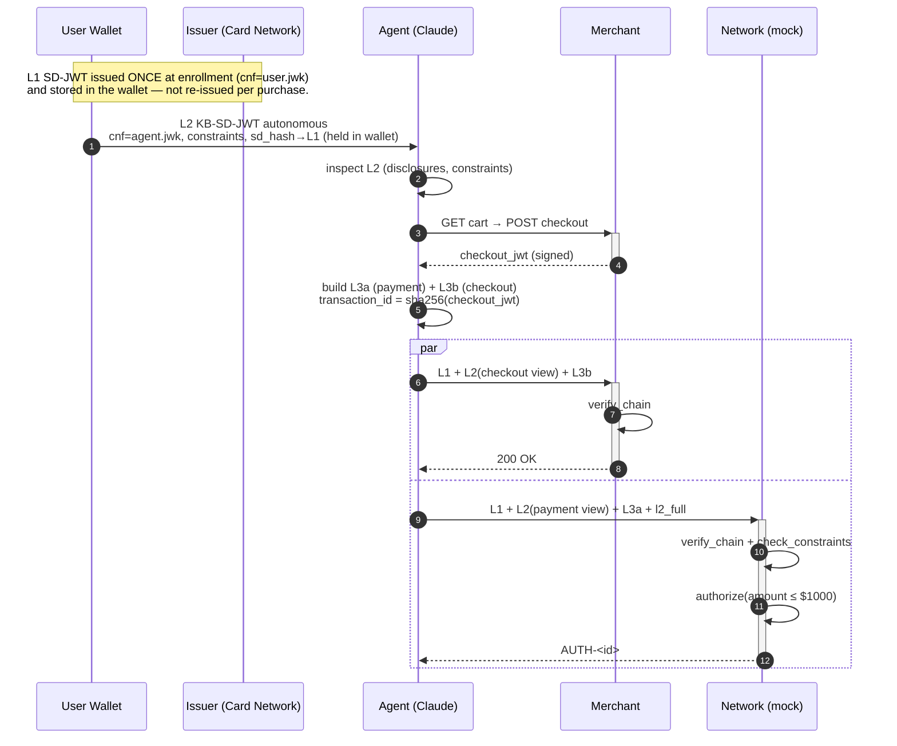

# Verifiable Intent — Architecture

A local, single-process demo of an autonomous Verifiable Intent (VI) purchase, with
five logical roles, real ES256 cryptography (via the official `verifiable-intent`
SDK), a Claude-driven agent, and a mock card network.

## Roles

| Role     | Key kid                   | Responsibility                                              |
| -------- | ------------------------- | ----------------------------------------------------------- |
| Issuer   | `issuer-key-1`            | Signs L1 card credential bound to the user's device key.    |
| Wallet   | `user-device-key-1`       | Signs L2 mandate (autonomous), delegates to the agent key. |
| Agent    | `agent-key-1`             | Picks product via Claude `tool_use`, signs L3a & L3b.       |
| Merchant | `merchant-key-1`          | Signs checkout JWT, verifies the checkout-side chain.       |
| Network  | `network-key-1`           | Verifies the payment-side chain, mock-authorizes payment.   |

Each role lives in its own module under [backend/app/roles/](../backend/app/roles)
and holds its own PEM keypair under `backend/keys/` (created on first run).

## Credential layers

```
L1 (Issuer SD-JWT)
 └── cnf.jwk = User device key
       └── L2 (Wallet KB-SD-JWT, AUTONOMOUS mode)
             ├── sd_hash → binds to L1
             ├── cnf.jwk = Agent key
             ├── constraints: allowed_merchants, line_items, amount_range, allowed_payees
             └── selectively disclosed: merchant record, acceptable items, mandates
                   ├── L3a (Agent payment, → Network)
                   │     └── delegate_payload references final payment fields
                   └── L3b (Agent checkout, → Merchant)
                         └── delegate_payload references final cart + checkout_hash
```

Cross-binding:
- `L3a.transaction_id == sha256(merchant.checkout_jwt) == L3b.checkout_hash`
- `L2-payment ↔ L2-checkout` linked by SD reference hash.

## Live flow (12 events from `POST /api/demo/run`)

| #   | Role     | Action                  | What happens                                                                     |
| --- | -------- | ----------------------- | -------------------------------------------------------------------------------- |
| 0   | system   | `demo_started`          | Echoes prompt + budget.                                                          |
| 1   | system   | `enrollment`            | Broadcasts every role's public JWK + kid.                                        |
| 2   | issuer   | `l1_issued`             | Issuer-signed L1 SD-JWT loaded from the wallet (signed once at enrollment).      |
| 3   | wallet   | `l2_created`            | Wallet KB-SD-JWT (autonomous) binds agent key, encodes constraints.              |
| 4   | agent    | `constraints_extracted` | Agent resolves disclosures: acceptable items, allowed merchants, budget.         |
| 5   | agent    | `product_selected`      | Claude `tool_use` returns chosen SKU + rationale (stub LLM falls back to first). |
| 6   | merchant | `checkout_jwt_signed`   | Merchant signs cart line-items into a JWT.                                       |
| 7   | agent    | `l3_built`              | Agent signs L3a (payment) and L3b (checkout), plus split L2 presentations.      |
| 8   | merchant | `verified`              | Merchant runs `verify_chain` over L1 + L2(checkout) + L3b.                       |
| 9   | network  | `verified`              | Network runs `verify_chain` + `check_constraints` over L1 + L2(payment) + L3a.   |
| 10  | network  | `authorized`/`declined` | Mock authorize: approve if amount ≤ \$1000 → `AUTH-<hex12>`.                     |
| 11  | system   | `demo_complete`         | Returns the summary (chain_valid, constraints_satisfied, authorized, …).         |

The orchestrator paces each step with a small `asyncio.sleep` so the UI can
animate the chain forming live.

## Sequence diagram



## Where to look in the code

| Concern                      | File                                                                       |
| ---------------------------- | -------------------------------------------------------------------------- |
| Per-role keypairs            | [backend/app/keys.py](../backend/app/keys.py)                              |
| Catalog + payment instrument | [backend/app/catalog.py](../backend/app/catalog.py)                        |
| Issuer L1                    | [backend/app/roles/issuer.py](../backend/app/roles/issuer.py)              |
| Wallet L2                    | [backend/app/roles/wallet.py](../backend/app/roles/wallet.py)              |
| Agent L3a/L3b                | [backend/app/roles/agent.py](../backend/app/roles/agent.py)                |
| Merchant verification        | [backend/app/roles/merchant.py](../backend/app/roles/merchant.py)          |
| Network verification + auth  | [backend/app/roles/network.py](../backend/app/roles/network.py)            |
| Claude tool_use              | [backend/app/llm.py](../backend/app/llm.py)                                |
| 12-event orchestrator        | [backend/app/orchestrator.py](../backend/app/orchestrator.py)              |
| FastAPI surface              | [backend/app/main.py](../backend/app/main.py)                              |
| Smoke test                   | [backend/tests/test_full_flow.py](../backend/tests/test_full_flow.py)      |
| React dashboard              | [frontend/src/App.tsx](../frontend/src/App.tsx)                            |
| WS store                     | [frontend/src/store.ts](../frontend/src/store.ts)                          |

## Plugging in real Stripe later

`network.authorize()` already has the seam: when `PAYMENT_NETWORK_MODE != "mock"`
it short-circuits and returns a "stripe adapter not implemented" decline. Replace
that branch with a `stripe.PaymentIntent.create(...)` call using the same
`payment_amount` + `payee` fields already resolved from the L3a delegate payload.
